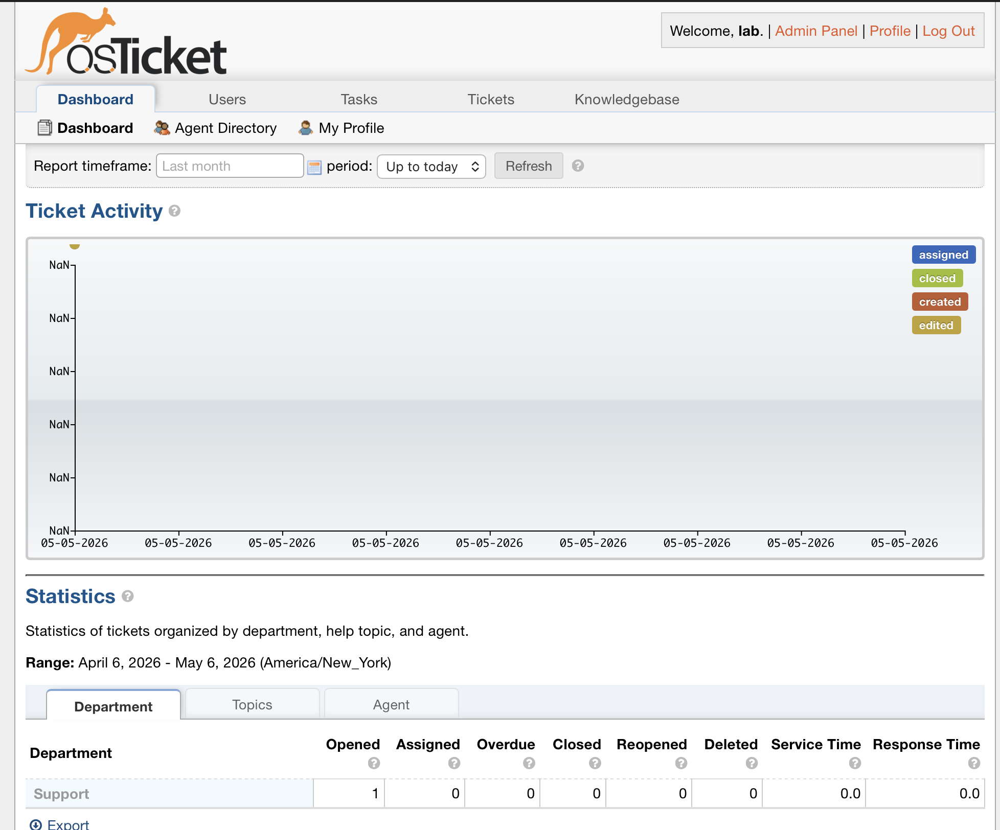
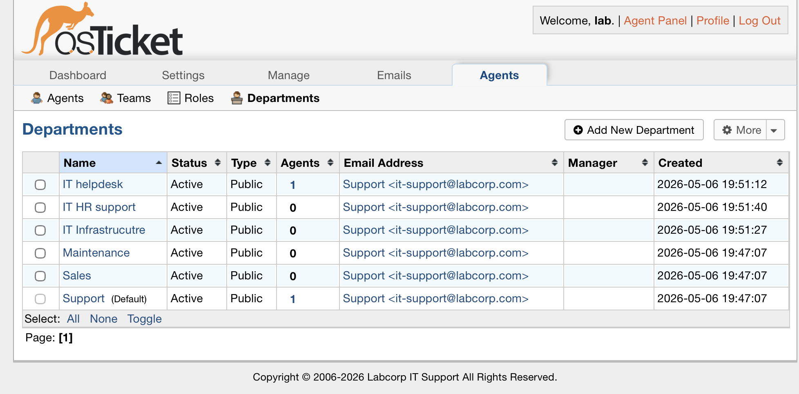
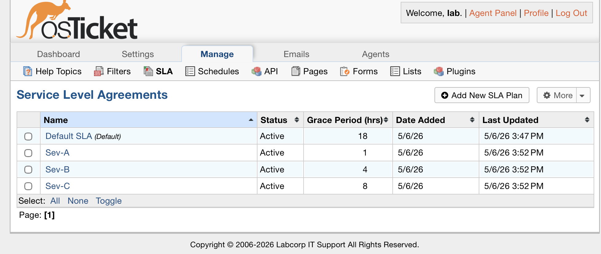
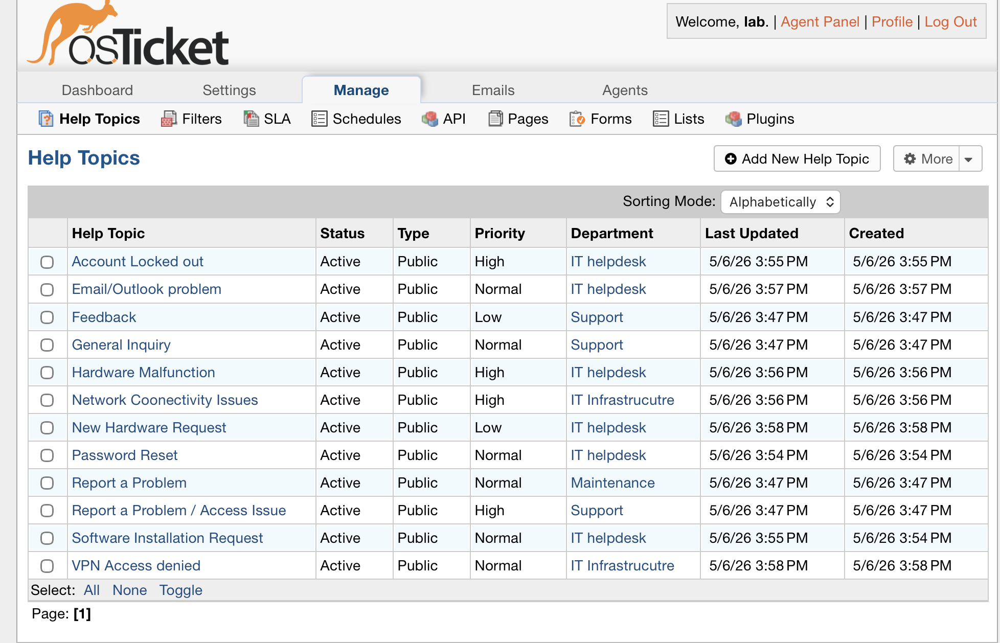
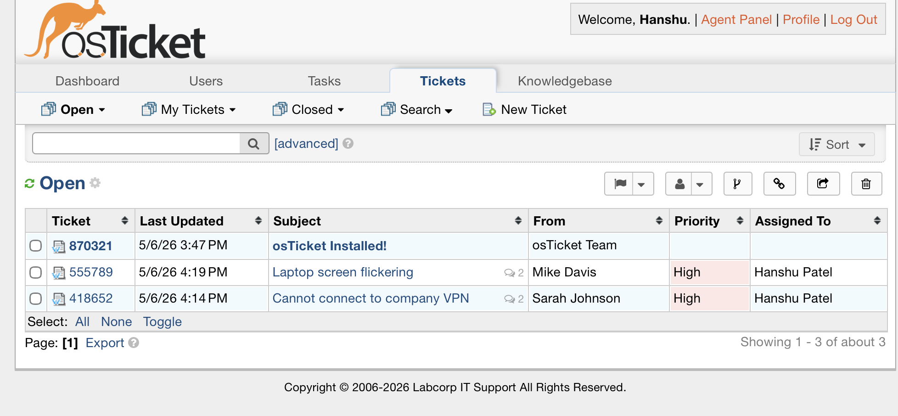
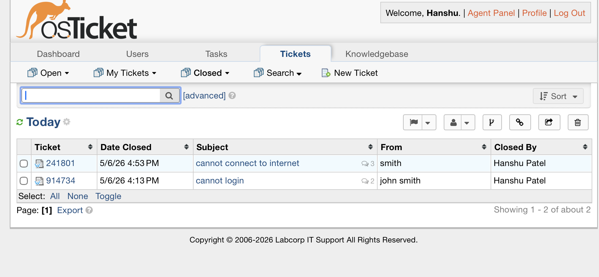

# osTicket Helpdesk Lab 🎫

Enterprise IT helpdesk simulation built on Ubuntu Server 26.04
running on VMware Fusion (Apple Silicon), featuring full ITSM
configuration and real-world ticket workflows.

## 🖥️ Lab Environment

| Component   | Details                        |
| ----------- | ------------------------------ |
| Host OS     | macOS (Apple Silicon M-series) |
| Hypervisor  | VMware Fusion Pro              |
| Server OS   | Ubuntu Server 26.04 LTS ARM64  |
| Web Server  | Apache 2.4                     |
| Database    | MySQL 8.4                      |
| PHP Version | 8.5                            |
| osTicket    | v1.18.1                        |
| Server IP   | 172.16.185.139                 |

## 🏗️ What I Built

### Departments Created

- IT Helpdesk
- IT Infrastructure
- HR Support

### SLA Plans Configured

| SLA   | Response Time | Schedule        | Use Case                |
| ----- | ------------- | --------------- | ----------------------- |
| Sev-A | 1 hour        | 24/7            | Critical — company-wide |
| Sev-B | 4 hours       | 24/7            | High — multiple users   |
| Sev-C | 8 hours       | Mon-Fri 8am-5pm | Normal — single user    |

### Help Topics Configured

- Password Reset
- Account Locked Out
- Software Installation Request
- Network Connectivity Issue
- Hardware Malfunction
- Email / Outlook Problem
- VPN Access Request
- New Hardware Request

## 🎟️ Ticket Lifecycle Practice

Practiced full Tier 1/2 ticket workflow:

1. User submits ticket via self-service portal
2. Agent receives and assigns ticket to themselves
3. SLA plan applied based on severity
4. Routed to correct department
5. Resolution documented in internal notes
6. Ticket closed with user notification

## 📸 Screenshots

### Admin Dashboard

### Departments

### SLA Plans

### Help Topics

### Active Ticket

### Resolved Ticket

## 🛠️ Technical Skills Demonstrated

- **Linux Administration** — Ubuntu Server setup, SSH,
  systemctl, apt package management
- **Web Server** — Apache virtual host configuration,
  mod_rewrite, site management
- **Database** — MySQL 8.4 user creation, privilege
  management, authentication configuration
- **ITSM** — Ticket intake, SLA adherence, department
  routing, escalation, resolution documentation
- **Troubleshooting** — Apache error logs, PHP/MySQL
  compatibility, authentication debugging
- **Networking** — NAT, SSH remote access,
  VMware virtual networking

## 📄 Documentation

Full step-by-step setup guide available in
[docs/osticket_setup_guide.docx](docs/osticket_setup_guide.docx)

## 🔗 Related Projects

- [IT Helpdesk Home Lab](link) — Full home lab with
  Active Directory and M365
